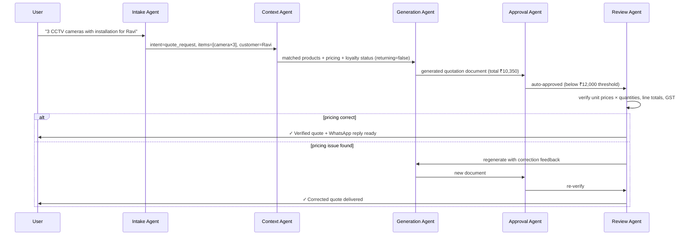

<div align="center">


# BizPilot AI

**Multi-Agent AI Copilot for Small Business Admin — Customer Messages → Quotes, Invoices & Replies**

[](https://biz-pilot.vercel.app)
[](https://nodejs.org)
[](https://react.dev)
[](https://ai.google.dev)
[](LICENSE)

</div>

---

## The Problem

While cold-pitching web development services to small business owners across Bengaluru — CCTV installers, electrical contractors, home-service providers — a pattern emerged immediately.

Their biggest daily friction wasn't marketing or accounting. It was **the gap between a customer WhatsApp message and a professional reply**.

A typical request arrives as:
> *"need quote for 3 cctv cameras with installation"*

What follows takes **10–15 minutes** of manual work:
1. Recall or look up unit prices from a price list or memory
2. Manually calculate quantities, subtotals, GST, and totals
3. Type out a formatted quotation in WhatsApp or Word
4. Copy-paste the reply back to the customer

This happens dozens of times a day. Pricing errors are common. Response times are slow. For a solo operator or a 2-person shop, this is **lost revenue and wasted expertise**.

BizPilot AI solves it end-to-end.

---

## The Solution

BizPilot AI converts raw natural language customer messages into **professional, verified business outputs** — quotations, invoices, policy replies, and follow-up messages — through a **transparent 5-agent AI pipeline**, in under a minute.

The business owner types (or pastes) the customer's message. BizPilot does the rest:

```
Customer WhatsApp message
         ↓
  [1] Intake Agent      — classify intent, extract entities
         ↓
  [2] Context Agent     — match products, look up pricing, check loyalty
         ↓
  [3] Generation Agent  — produce the document + human-readable reply
         ↓
  [4] Approval Agent    — auto-approve or route to owner for high-value orders
         ↓
  [5] Review Agent      — verify every price, line total, and GST figure
         ↓
  Verified Quote / Invoice / Reply → one-tap WhatsApp share or PDF download
```

Every step is visible in the live pipeline view, so the owner stays in control — they see exactly what each agent decided and why.

---

## Key Features

- **5-agent transparent pipeline** — Intake → Context → Generation → Approval → Review, each with a live status feed visible to the user
- **Self-verifying output** — the Review Agent cross-checks every unit price and line total against the master product catalog before the output is shown; if anything is wrong, it triggers one automatic regeneration cycle
- **Returning-customer loyalty discount** — the Context Agent tracks visit history in-session; repeat customers automatically receive a 5% loyalty discount, reflected in the document and GST calculation
- **High-value order approval routing** — orders above ₹12,000 are automatically flagged and routed to the owner (simulated Rahul Sharma approval) before the quote is finalised
- **Multilingual replies** — generated customer-facing messages can be switched between English, Kannada (ಕನ್ನಡ), and Hindi (हिंदी)
- **One-tap WhatsApp sharing** — the formatted reply opens directly in WhatsApp (`wa.me` deep link) with the full message pre-filled; no copy-paste needed
- **Professional PDF export** — quotes and invoices download as properly formatted A4 PDFs with line items, GST breakdown, and company letterhead via jsPDF
- **Rule-based fallback** — if the Gemini API is unavailable or rate-limited, every agent falls back to deterministic rule-based logic; the app stays fully functional
- **Fully mobile-responsive** — dedicated mobile layout with an accordion pipeline view and a bottom-sheet document preview

---

## Tech Stack

### Frontend
| Technology | Role |
|---|---|
| React 19 + Vite 8 | UI framework and dev server |
| Tailwind CSS 4 | Utility-first styling |
| Lucide React | Icon set |
| jsPDF | Client-side PDF generation |
| `wa.me` deep links | WhatsApp message pre-fill and share |

### Backend
| Technology | Role |
|---|---|
| Node.js + Express 4 | HTTP server and pipeline orchestrator |
| `@google/generative-ai` | Gemini 2.5 Flash — intent classification, generation, review |
| `@anthropic-ai/sdk` | Claude — reserved for fallback classification |
| `uuid` | Unique request IDs for pipeline tracing |
| `dotenv` | Environment variable management |
| In-memory store | Customer visit tracking (loyalty discount state) |

### AI & Data
| Component | Details |
|---|---|
| Intake Agent | Gemini 2.5 Flash with few-shot prompting; classifies into `quote_request`, `invoice_request`, `customer_query`, `follow_up`, `unclear` |
| Context Agent | Rule-based product matcher + fuzzy alias lookup against `seed.json` catalog; loyalty check via visit counter |
| Generation Agent | Gemini 2.5 Flash structured output; produces document JSON + human-readable multilingual reply |
| Approval Agent | Deterministic threshold logic (₹12,000); no LLM required |
| Review Agent | Gemini-assisted + deterministic pricing verifier; triggers one regeneration cycle on failure |
| Product Catalog | `backend/data/seed.json` — 12 products & services with aliases for fuzzy matching |

### Deployment
| Layer | Platform |
|---|---|
| Frontend | [Vercel](https://vercel.com) — `biz-pilot.vercel.app` |
| Backend | [Render](https://render.com) — Node.js web service |

---

## Live Demo

🚀 **[https://biz-pilot.vercel.app](https://biz-pilot.vercel.app)**

**Try these demo inputs to see the full pipeline:**
- `"Need quote for 3 CCTV cameras with installation"` → generates a full itemised quotation
- `"Create invoice for 2 CCTV cameras and one DVR"` → generates a GST invoice with line totals
- `"What is your refund policy?"` → pulls from the company policy document context
- `"Follow up with customer who asked price yesterday"` → drafts a follow-up message

> **Note on response time:** Live requests go through the Gemini 2.5 Flash API; first responses may take 3–8 seconds depending on API load. If the API is unreachable, the pipeline automatically switches to rule-based mode — all features remain functional, the only difference is the reply text is template-based rather than LLM-generated.

---

## Installation

### Prerequisites
- Node.js ≥ 18
- npm ≥ 9
- A [Google AI Studio API key](https://aistudio.google.com/app/apikey) (free tier works)

### 1. Clone the repo

```bash
git clone https://github.com/Afnan-0206/BizPilot.git
cd BizPilot
```

### 2. Set up the backend

```bash
cd backend
npm install
```

Create your environment file:

```bash
cp .env.example .env
```

Open `.env` and fill in your Gemini API key:

```env
GEMINI_API_KEY=your_actual_api_key_here
GEMINI_MODEL=gemini-2.5-flash
PORT=3001
NODE_ENV=development
```

Start the backend:

```bash
npm run dev        # development — auto-restarts on file changes (nodemon)
# or
npm start          # production
```

The backend will be live at **http://localhost:3001**. Verify with:

```bash
curl http://localhost:3001/health
```

### 3. Set up the frontend

Open a new terminal window:

```bash
cd frontend
npm install
npm run dev
```

The frontend will be live at **http://localhost:5173**.

### 4. One-command start (Windows)

From the project root, double-click **`start.bat`** or run it from a terminal:

```bat
start.bat
```

This opens both the backend and frontend in separate terminal windows simultaneously.

### Environment Variables Reference

| Variable | Required | Default | Description |
|---|---|---|---|
| `GEMINI_API_KEY` | Yes (for AI mode) | — | Google AI Studio API key |
| `GEMINI_MODEL` | No | `gemini-2.5-flash` | Gemini model identifier |
| `PORT` | No | `3001` | Backend server port |
| `NODE_ENV` | No | `development` | Node environment |

> **No API key?** The backend runs in rule-based mode automatically when `GEMINI_API_KEY` is absent or set to the placeholder value. All 5 pipeline agents still execute — LLM-generated text is replaced with deterministic templates, but every other feature (pricing, PDF, WhatsApp, loyalty discounts, approval routing) works exactly the same.

---

## Project Structure

```
bizpilot-ai/
├── backend/
│   ├── agents/
│   │   ├── intake.js       # Agent 1 — intent classification & entity extraction
│   │   ├── context.js      # Agent 2 — product matching, pricing, loyalty
│   │   ├── generation.js   # Agent 3 — document + reply generation
│   │   ├── approval.js     # Agent 4 — threshold-based approval routing
│   │   └── review.js       # Agent 5 — self-correction & pricing verification
│   ├── data/
│   │   └── seed.json       # Product catalog, services, FAQs, business info
│   ├── lib/
│   │   └── store.js        # In-memory customer visit tracker
│   ├── .env.example        # Environment variable template
│   └── server.js           # Express server & pipeline orchestrator
│
├── frontend/
│   ├── public/             # Static assets (favicon, apple-touch-icon, OG image)
│   └── src/
│       ├── assets/
│       │   └── bizpilot_icon.svg       # Brand icon (header)
│       ├── components/
│       │   ├── ChatPanel.jsx           # Message input + conversation thread
│       │   ├── PipelineVisualizer.jsx  # Live agent step feed
│       │   ├── DocumentPreview.jsx     # Quote/Invoice preview + PDF download
│       │   ├── WhatsAppPreview.jsx     # Reply preview + wa.me share button
│       │   ├── StatsDashboard.jsx      # Request counts & intent breakdown
│       │   └── InteractionLogs.jsx     # Full pipeline history log
│       ├── lib/
│       │   └── pdfGenerator.js         # jsPDF A4 document builder
│       ├── services/
│       │   └── api.js                  # Backend API client
│       └── App.jsx                     # Root layout, routing, mobile/desktop state
│
├── bizpilot_logo_dark_bg.png   # Project logo (README + OG image)
└── start.bat                   # Windows one-command launcher
```

---

## Pipeline Architecture



---

## Built at TakeOver Hackathon 2026

BizPilot AI was built for the **TakeOver Hackathon** — a 24-hour product sprint focused on real-world impact for Indian SMEs.

The problem is real. The people it's built for are real. Every design decision — the 5-agent pipeline structure, the rule-based fallback, the WhatsApp-first output, the multilingual replies, the ₹12,000 approval threshold — came from conversations with actual business owners, not assumptions.

---

<div align="center">

Made with ☕ and urgency in Bengaluru.

</div>
